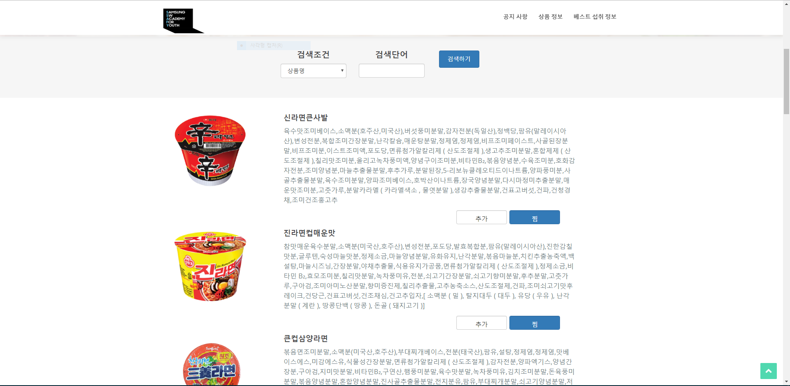
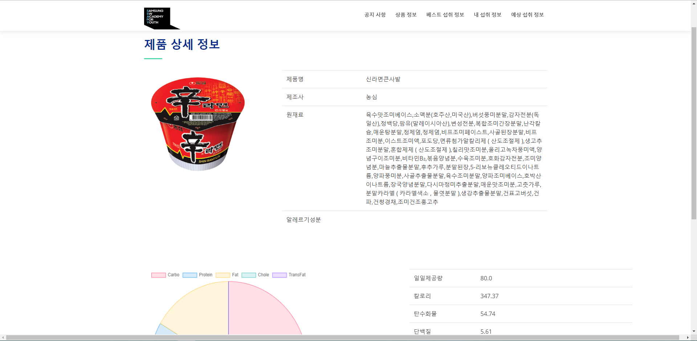
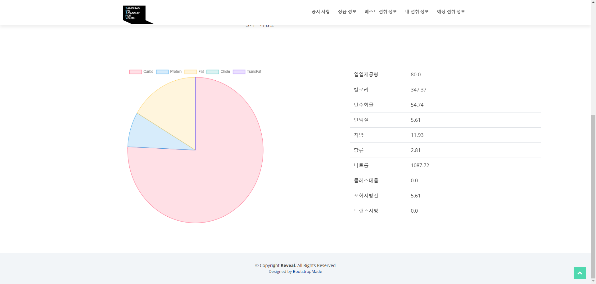
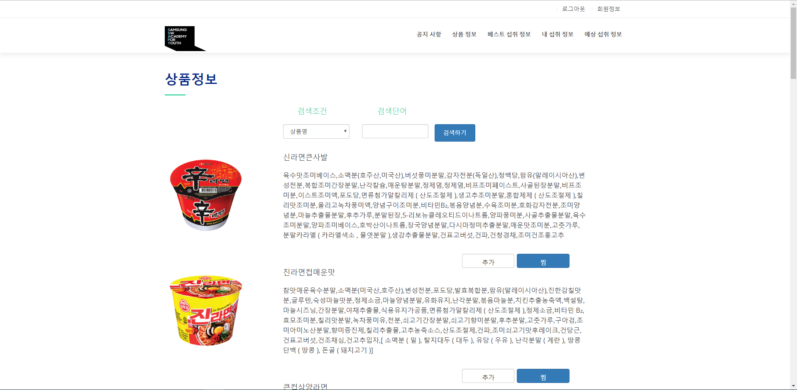
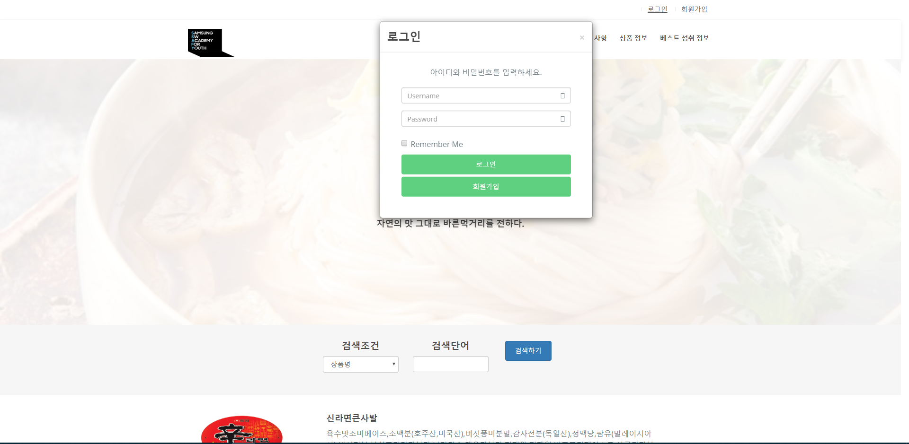
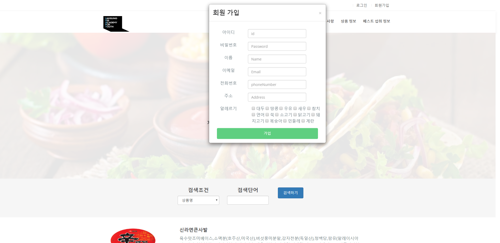
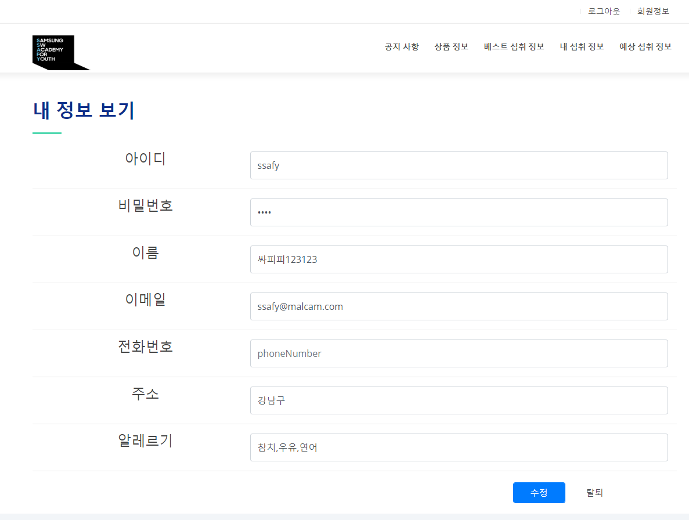

[Web BackEnd PJT] 안전 먹거리 Project - SafeFood (2019.09.26)
================================================================
### <구현기능>
> 기본 기능
>> 1. 식품정보 관리
>>> * 메인페이지
>>> * 식품명 검색
>>> * 식품 목록 검색
>>> * 식품 상세 검색
>> 2. 회원관리(로그인/로그아웃)
>>> * 회원정보 등록
>>> * 회원정보 수정
>>> * 회원정보 삭제
>>> * 회원정보 검색
>>> * 로그인/로그아웃

* **메인 페이지**
 

* **제품 상세 페이지**
 

* **상품 정보 페이지**
 

* **로그인 페이지**
 

* **회원가입 페이지**
 

* **회원정보 페이지**
 
