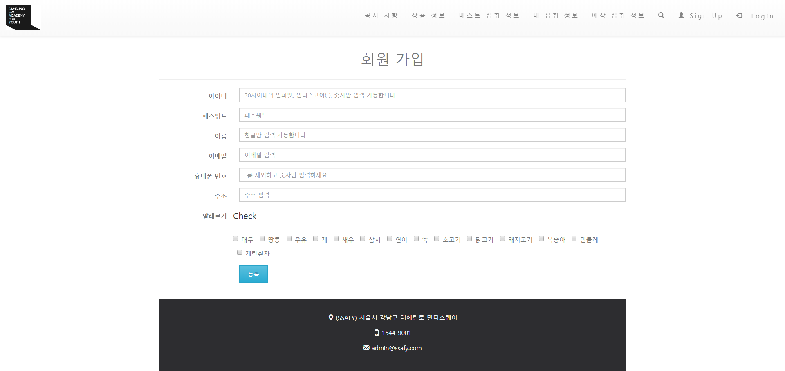
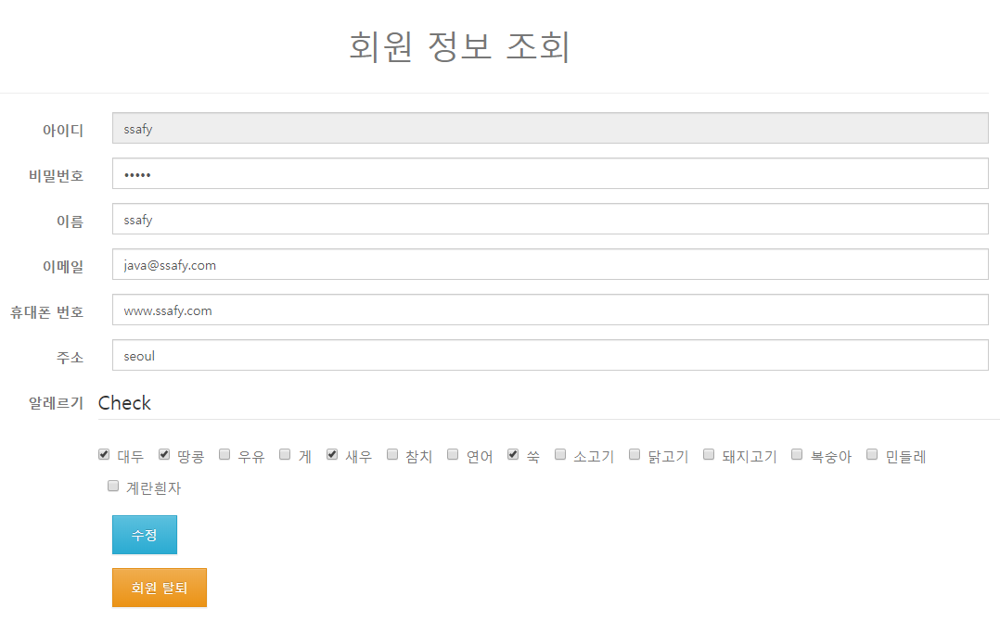
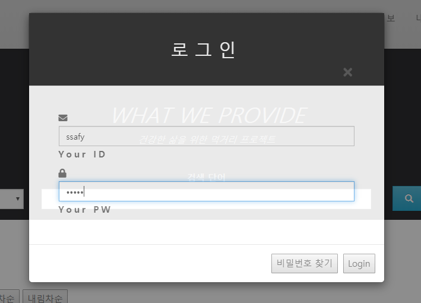
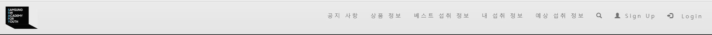
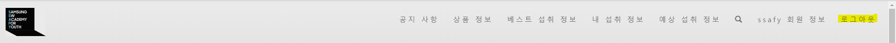
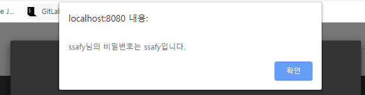
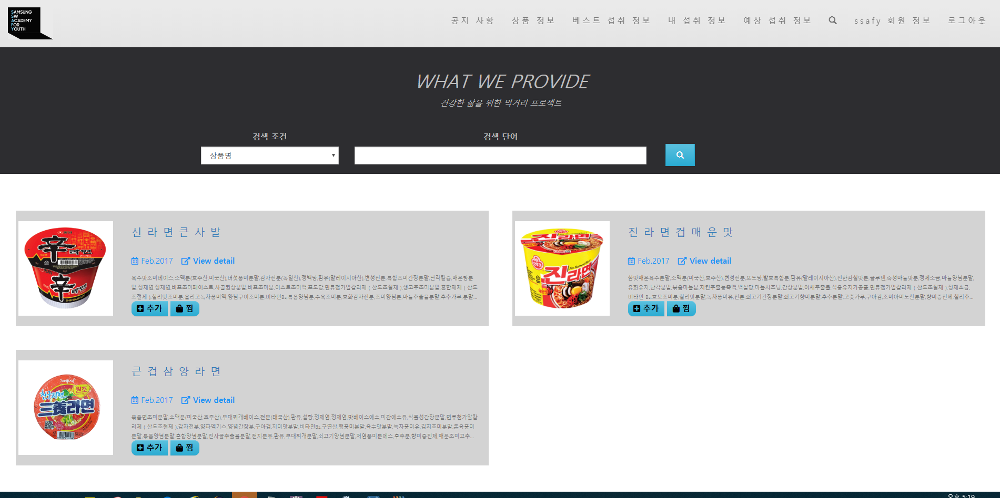
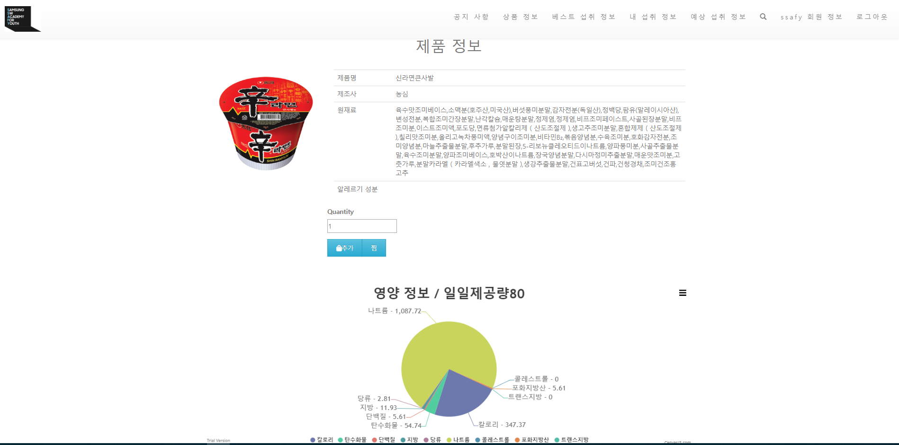

# 안전 먹거리 Project
- 서울 6반 백창현, 이병훈

## 날짜 : 2019.11.08

--- 
## 구현 내용
1) 메인 페이지( 식품 정보를 활용하여 구성) (Spring & MyBais 기반) - 완료
2) 식품 정보 (영양분, 첨가물 ) 목록 서비스 (Spring & MyBais 기반) - 완료
3) 식품 정보 (영양분, 첨가물 ) 상세 서비스 (Spring & MyBais 기반) - 완료
4) 회원정보 등록, 수정, 삭제, 검색 서비스 (Spring & MyBais 기반) - 완료
5) 로그인/ 로그아웃 서비스 (Spring & MyBais 기반) - 완료

### 구현 페이지
- 회원 정보 데이터 관리 (MyBatis 사용)
  * 회원 정보 관리
  - 회원 가입
  
  - 회원 정보 관리 (수정, 삭제, 조회)
  
  * 로그인/아웃
  
  - 로그인 전 메뉴바
  
  - 로그인 후 메뉴바
  
  - 비밀번호 찾기
  
- 식품데이터 관리 (MyBatis 사용)
  * 메인페이지
  
  * 조건별 검색
  
  * 식품정보 상세정보
  